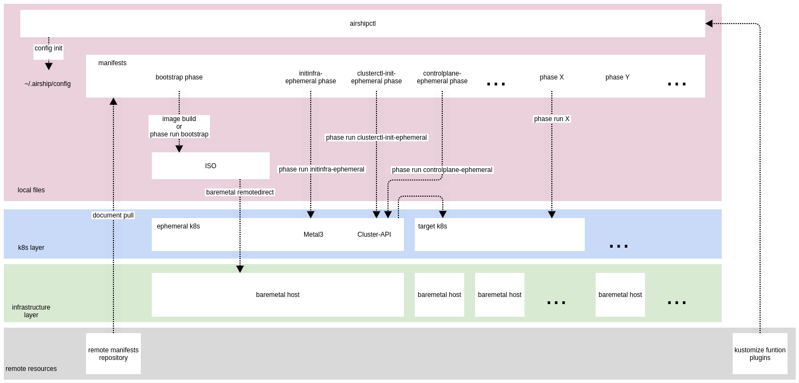

## Architecture

The `airshipctl` tool is designed to work against declarative infrastructure
housed in source control and manage the lifecycle of a site.

## Example Usage

In a nutshell, users of `airshipctl` are able to do the following:

1. Create an `airshipctl` configuration file. `airshipctl` can create a default
   configuration file (`~/.airship/config`) running the command
   `airshipctl config init`. Users can modify the config file according to
   their needs.
1. Run `airshipctl document pull` to clone the document repositories defined in the
   `airshipctl` config file. These repositories contain declarative documents which
   are used to bootstrap and manage infrastructure, kubernetes clusters and workloads.
1. When deploying against baremetal infrastructure, run
   `airshipctl image build` to generate a self-contained ISO that can be
   used to bootstrap an ephemeral Kubernetes node on top of a baremetal host.

   **NOTE:** *Most of the `airshipctl` functionality is implemented as phases. When `airshipctl`
   performs an action, it likely runs a phase or multiple phases defined in phase documents.
   `airshipctl phase` command can be used to run a specific phase. For example
   to build the ISO one can run the command `airshipctl phase run bootstrap`*

1. Once the ISO is generated, run `airshipctl baremetal remotedirect` to remotely
   provision the ephemeral baremetal node and deploy a Kubernetes
   instance that `airshipctl` can communicate with for subsequent steps. This
   ephemeral host provides a foothold in the target environment so we can follow
   the standard cluster-api bootstrap flow.
1. Run `airshipctl phase run initinfra-ephemeral` to bootstrap the new ephemeral cluster
   with the necessary infrastructure components to provision the target cluster.
1. Run `airshipctl phase run clusterctl-init-ephemeral` to install cluster-api components
   to the ephemeral Kubernetes instance.
1. Run `airshipctl phase run controlplane-ephemeral` to create cluster-api objects for the first
   target cluster which will be deployed using cluster-api.

Further steps depend on what exactly a user wants to have as a result. Usually, users transform
their first target cluster into a cluster-api management cluster and then use it to deploy workload
clusters. To transform a Kubernetes cluster into a cluster-api management cluster, it is
necessary to deploy infrastructure components and the cluster-api components.

As users evolve their sites declaration, whether adding additional
infrastructure, or software declarations, they can create phase definitions to apply those
changes to the site using builtin phase executors and run those phases using the command
`airshipctl phase run <phasename>`.
